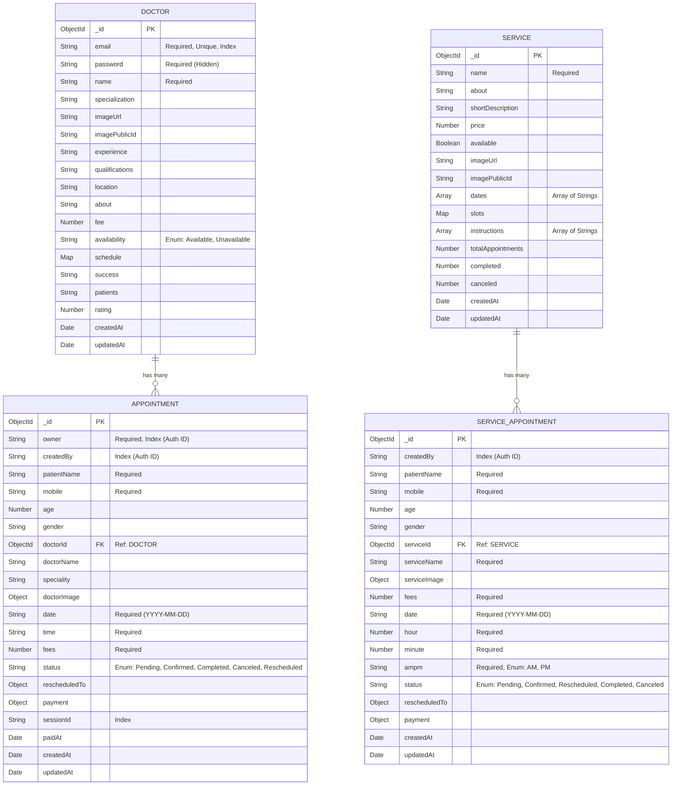

# Medicare Database Schema

Based on the `backend/models` directory, here is the database schema for the Medicare application. The system uses MongoDB with Mongoose. Authentication for patients seems to be handled via an external provider (like Clerk, based on the `package.json`), which is why there is no separate `User` model and `owner`/`createdBy` fields are stored as strings (likely external user IDs).

## Schema Diagram

## Collections Breakdown

### 1. Doctor (`doctors` collection)
Stores information about medical professionals.
| Field | Type | Attributes | Description |
| :--- | :--- | :--- | :--- |
| `_id` | ObjectId | Primary Key | MongoDB auto-generated ID |
| `email` | String | Required, Unique, Index | Doctor's email address |
| `password` | String | Required, Select: false | Password for doctor login |
| `name` | String | Required | Doctor's full name |
| `specialization`| String | Text Index | Medical specialization |
| `imageUrl` | String | | Cloudinary/S3 Image URL |
| `imagePublicId`| String | | Cloudinary Public ID |
| `experience` | String | | Years of experience |
| `qualifications`| String | | Doctor's qualifications |
| `location` | String | | Clinic/Hospital location |
| `about` | String | | Doctor bio/description |
| `fee` | Number | Default: 0 | Consultation fee |
| `availability` | Enum | Available/Unavailable | Current availability status |
| `schedule` | Map<String>| | Mapping of days to available time slots |
| `success` | String | | Success rate / metrics |
| `patients` | String | | Number of patients treated |
| `rating` | Number | Default: 0 | Doctor's rating |

### 2. Service (`services` collection)
Stores hospital/clinic services (e.g., MRI, X-Ray, Blood Test).
| Field | Type | Attributes | Description |
| :--- | :--- | :--- | :--- |
| `_id` | ObjectId | Primary Key | MongoDB auto-generated ID |
| `name` | String | Required, Text Index| Service name |
| `about` | String | | Detailed description |
| `shortDescription`| String | Text Index | Brief summary of the service |
| `price` | Number | Default: 0 | Cost of the service |
| `available` | Boolean | Default: true | Is the service currently active? |
| `imageUrl` | String | | Cloudinary Image URL |
| `imagePublicId` | String | | Cloudinary Public ID |
| `dates` | Array<String>| | Available dates |
| `slots` | Map<String>| | Time slots mapped by date |
| `instructions` | Array<String>| | Pre-service patient instructions |
| `totalAppointments`| Number | Default: 0 | Total bookings for this service |
| `completed` | Number | Default: 0 | Completed bookings |
| `canceled` | Number | Default: 0 | Canceled bookings |

### 3. Appointment (`appointments` collection)
Stores bookings made by patients for specific **Doctors**.
| Field | Type | Attributes | Description |
| :--- | :--- | :--- | :--- |
| `_id` | ObjectId | Primary Key | MongoDB auto-generated ID |
| `owner` | String | Required, Index | Patient's auth ID (e.g., Clerk ID) |
| `createdBy` | String | Index | User who created the booking |
| `patientName` | String | Required | Patient's full name |
| `mobile` | String | Required | Patient's contact number |
| `age` | Number | | Patient's age |
| `gender` | String | | Patient's gender |
| `doctorId` | ObjectId | Required, Ref | Reference to the `Doctor` collection |
| `doctorName` | String | | Denormalized doctor name |
| `speciality` | String | | Denormalized specialization |
| `doctorImage` | Object | {url, publicId} | Snapshot of doctor's image |
| `date` | String | Required | Appointment date (YYYY-MM-DD) |
| `time` | String | Required | Appointment time slot |
| `fees` | Number | Required | Consultation fee at booking time |
| `status` | Enum | Default: Pending | Pending, Confirmed, Completed, Canceled, Rescheduled |
| `rescheduledTo` | Object | {date, time} | New slot if rescheduled |
| `payment` | Object | {method, status, amount, providerId, meta} | Payment details (Cash/Online, Stripe integration) |
| `sessionId` | String | Index | Stripe checkout session ID |
| `paidAt` | Date | | Timestamp of successful payment |

### 4. ServiceAppointment (`serviceappointments` collection)
Stores bookings made by patients for **Services** (No doctor involved).
| Field | Type | Attributes | Description |
| :--- | :--- | :--- | :--- |
| `_id` | ObjectId | Primary Key | MongoDB auto-generated ID |
| `createdBy` | String | Index | Patient's auth ID |
| `patientName` | String | Required | Patient's full name |
| `mobile` | String | Required | Patient's contact number |
| `age` | Number | Min: 0 | Patient's age |
| `gender` | Enum | | Male, Female, Other, "" |
| `serviceId` | ObjectId | Required, Ref | Reference to the `Service` collection |
| `serviceName` | String | Required | Denormalized service name for UI speed |
| `serviceImage` | Object | {url, publicId} | Snapshot of service image |
| `fees` | Number | Required | Service cost at booking time |
| `date` | String | Required, Index | Appointment date (YYYY-MM-DD) |
| `hour` | Number | Required | Booking hour (1-12) |
| `minute` | Number | Required | Booking minute (0-59) |
| `ampm` | Enum | Required | AM or PM |
| `status` | Enum | Default: Pending | Pending, Confirmed, Rescheduled, Completed, Canceled |
| `rescheduledTo` | Object | {date, hour, minute, ampm} | New slot if rescheduled |
| `payment` | Object | {method, status, amount, providerId, paidAt, sessionId, meta} | Payment details (Cash/Online, Stripe integration) |

> [!NOTE]
> The database schema leans into NoSQL paradigms by selectively denormalizing data. For instance, `doctorName`, `doctorImage`, `serviceName`, and `serviceImage` are saved within the appointment documents themselves to optimize frontend read speeds and keep historical context in case the source entity changes.
