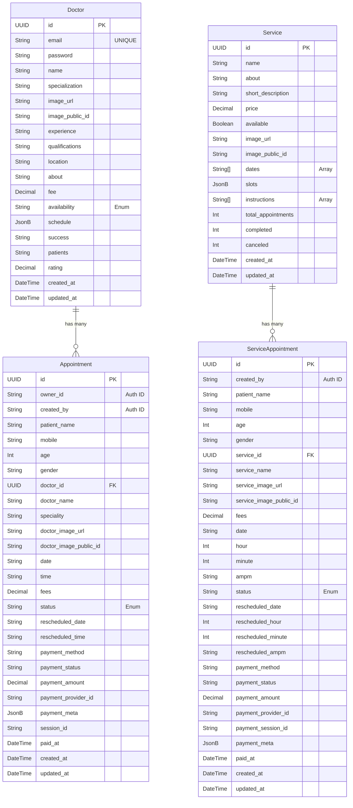

# PostgreSQL Database Schema

Your codebase is currently using **MongoDB (with Mongoose)** as you noticed in the `models` folder. The schema I provided earlier reflected that MongoDB structure. 

If you want to migrate this to **PostgreSQL**, a relational database, the structure changes slightly. In PostgreSQL, we replace ObjectIds with `UUID`s, flatten some nested objects, and take advantage of PostgreSQL's native `JSONB` or `Array` types for things like schedules and dates.

Here is the equivalent PostgreSQL schema design. I have also included a **Prisma schema** below, as Prisma is the most popular ORM for PostgreSQL in Node.js applications.

## Schema Diagram (Relational)



## Prisma Schema (`schema.prisma`)

If you migrate your Node.js application to PostgreSQL, using [Prisma](https://www.prisma.io/) is highly recommended. Here is what your `schema.prisma` file would look like:

```prisma
generator client {
  provider = "prisma-client-js"
}

datasource db {
  provider = "postgresql"
  url      = env("DATABASE_URL")
}

model Doctor {
  id              String   @id @default(uuid())
  email           String   @unique
  password        String
  name            String
  specialization  String?
  imageUrl        String?
  imagePublicId   String?
  experience      String?
  qualifications  String?
  location        String?
  about           String?
  fee             Float    @default(0)
  availability    String   @default("Available") // "Available" | "Unavailable"
  schedule        Json?    @default("{}")
  success         String?
  patients        String?
  rating          Float    @default(0)
  createdAt       DateTime @default(now())
  updatedAt       DateTime @updatedAt

  appointments    Appointment[]
}

model Service {
  id                String   @id @default(uuid())
  name              String
  about             String?
  shortDescription  String?
  price             Float    @default(0)
  available         Boolean  @default(true)
  imageUrl          String?
  imagePublicId     String?
  dates             String[] @default([]) // Native PostgreSQL text array
  slots             Json?    @default("{}")
  instructions      String[] @default([]) // Native PostgreSQL text array
  totalAppointments Int      @default(0)
  completed         Int      @default(0)
  canceled          Int      @default(0)
  createdAt         DateTime @default(now())
  updatedAt         DateTime @updatedAt

  serviceAppointments ServiceAppointment[]
}

model Appointment {
  id              String   @id @default(uuid())
  owner           String   // Patient Auth ID (Clerk)
  createdBy       String?
  patientName     String
  mobile          String
  age             Int?
  gender          String?

  // Relation to Doctor
  doctorId        String
  doctor          Doctor   @relation(fields: [doctorId], references: [id])
  
  // Denormalized fields for quick UI access
  doctorName      String?
  speciality      String?
  doctorImageUrl  String?
  doctorImagePubId String?

  date            String   // YYYY-MM-DD
  time            String
  fees            Float
  status          String   @default("Pending") // Pending, Confirmed, Completed, Canceled, Rescheduled
  
  rescheduledDate String?
  rescheduledTime String?

  paymentMethod   String   @default("Cash") // Cash, Online
  paymentStatus   String   @default("Pending") // Pending, Paid, Failed, Refunded
  paymentAmount   Float    @default(0)
  paymentProviderId String?
  paymentMeta     Json?
  
  sessionId       String?
  paidAt          DateTime?
  
  createdAt       DateTime @default(now())
  updatedAt       DateTime @updatedAt

  @@index([owner])
  @@index([doctorId])
  @@index([sessionId])
}

model ServiceAppointment {
  id              String   @id @default(uuid())
  createdBy       String?  // Patient Auth ID (Clerk)
  patientName     String
  mobile          String
  age             Int?
  gender          String?

  // Relation to Service
  serviceId       String
  service         Service  @relation(fields: [serviceId], references: [id])
  
  // Denormalized fields
  serviceName     String
  serviceImageUrl String?
  serviceImagePubId String?

  fees            Float
  date            String   // YYYY-MM-DD
  hour            Int
  minute          Int
  ampm            String   // AM, PM
  status          String   @default("Pending") // Pending, Confirmed, Rescheduled, Completed, Canceled

  rescheduledDate String?
  rescheduledHour Int?
  rescheduledMinute Int?
  rescheduledAmpm String?

  paymentMethod   String   @default("Cash")
  paymentStatus   String   @default("Pending")
  paymentAmount   Float
  paymentProviderId String?
  paymentSessionId String?
  paymentMeta     Json?
  
  paidAt          DateTime?
  
  createdAt       DateTime @default(now())
  updatedAt       DateTime @updatedAt

  @@index([date, status])
  @@index([serviceId])
  @@index([paymentSessionId])
}
```
